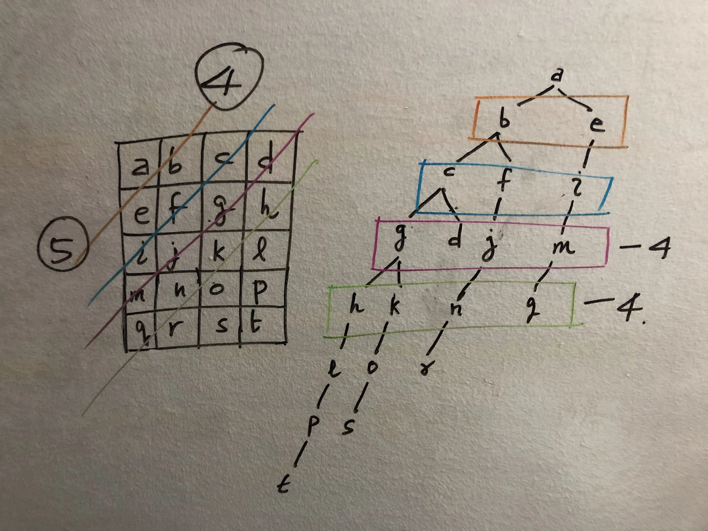

# 개념

- vertex 집합 V와 edge 집합 E로 구성된 자료구조이다.    
- 그래프는 collection of vertices and edges이다. 각 edge는 direction을 가질 수도 있고 안 가질 수도 있다. weight도 가질 수도 있고 안 가질 수도 있다.   
- 트리는 그래프의 한 종류인데 connected, acyclic, and undirected graph 이다.
  - vertex의 수가 V라고 할 때, edge의 수는 V-1 개이다.
- Tree의 경우는 root가 존재하고 root만 알면 다 조회가 가능하다.   

### 용어

- DAG
  - 방향은 있지만 사이클이 없는 그래프이다. 
  - 위상 정렬(topological sort)을 할 수 있는 유일한 그래프 형태이다.
- Bipartite graph(이분 그래프)
  - 모든 vertex 를 두 개의 그룹으로 나눴을 때, 같은 그룹끼리는 edge가 존재하지 않는 그래프이다.
  - 즉, 모든 간선의 양 끝점은 서로 다른 그룹에 속해야한다.
  - 사이클을 구성하는 정점의 개수가 홀수면 불가능하다.
- Complete graph
  - 모든 vertex pair 가 edge로 연결된 그래프이다. 
  - edge의 수는 `|V|(|V|-1) / 2` 이다.
- cut
  - 그래프에서 두 개의 disjoint subset으로 나눌 때의 각 파티션이다.
- crossing edge
  - 하나의 vertex set에서 다른 vertex set으로 연결하는 edge들이다.
- adjacency list
  - 각 vertex는 인접한 노드의 리스트를 갖고 있다. undirected라면 연결된 두 노드는 서로의 노드를 저장한다.
- adjacency matrix
  - N개의 노드에 대해서 NxN matrix를 갖고 (i, j) 위치의 값은 i에서 j로의 edge가 있는지를 나타내는 boolean 값이다. undirected graph라면 symmetric matrix가 만들어진다.
  - edge 수가 node 수에 비해 상당히 클 때 효과적이다. edge 수가 적으면 matrix가 차지하는 공간에 비해 실제 사용되는 데이터가 적기 때문에 비효율적이다.
  - adjacent node를 iterate한다고 했을 때 adjacency list를 사용하면 바로 접근이 가능하지만 adjacency matrix를 사용하면 한 row를 다 읽어야한다.
- sparse graph
  - vertex 수보다 edge 수가 적은 그래프이다.
- dense graph
  - E가 V^2(최대 간선의 수)에 가까운 그래프이다. 이 때는 adjacency matrix 가 효율적이다.
- connected
  - undirected graph: 모든 vertex 사이에 경로가 존재하면 connected이다.
  - directed graph
    - strongly connected: 모든 vertex u, v에 대해 u->v 경로와 v->u 경로가 모두 존재할 때
    - weakly connected: 방향을 무시하고 간선으로만 보았을 때 연결되어 있을 때
- clique
  - vertex set 중에 모든 vertex가 서로 인접해 있는 (즉, 완전 그래프 형태인) 그래프를 말한다.
- degree
  - vertex 에 연결된 edge의 수이다.
  - directed graph 에서는 in-degree 와 out-degree 로 나뉜다.

### 특징

- DAG 그래프에서 만들 수 있는 distinct, non-empty path 의 수: `pow(2, N) - 1`
  - `[a, b, c]` 가 있다면, `[a]`, `[b]`, `[c]`, `[a, b]`, `[a, c]`, `[b, c]`, `[a, b, c]` 각각의 노드를 거치는 distinct paths이다. `[]`는 제외했다.   
  - 경로에 각각의 노드가 있냐 없냐로 따지면 각 노드마다 true/false 두 가지의 경우의 수가 있게 되고, 모든 노드에 적용시키면 2^N이다.
  - 만약 시작점이 A vertex 로 주어진다면 나머지 N-1개를 대상으로 해야하므로 `pow(2, N-1) - 1` 이다.

## Search

### DFS

- 두 노드 사이의 path와 관련된 문제일 때 고려할 수 있는 방법이다.   
- 모든 path를 찾을 때 쓸 수 있다.   
- stack 혹은 recursion을 사용한다.
- Complexity
  - Time
    - Adjacency list 사용하는 경우: O(V+E)
    - Adjacency matrix 사용하는 경우: O(V^2) => VxV 행렬을 모두 읽어야한다.
  - Space
    - O(V): 그래프가 한 줄로 이어진 경우 재귀호출 스택에 모든 노드가 쌓여있게 된다.
- All possible paths
  - All possible paths를 구할 때 recursion을 사용하여 backtracking을 한다.   
  - 이 때 각 작업마다 path를 고유하게 갖고 있어야하는데 처음에는 다음 recursion을 호출할 때 현재 path를 deepcopy하여 넘겨줬다.   
  - 그런데 그렇게 하면 너무 시간이 많이 걸리기 때문에 dfs함수 부를 때 cur_path list를 넘겨줘서 그대로 사용한다. dfs 함수가 끝나면 cur_path.pop()를 해주는 방식으로 원래의 상태로 돌아옴으로써 시간을 절약할 수 있다.   
  - Time: O(2^N * N) => 가능한 path가 2^(N-1)-1, 각 path마다 다음 path 만들 때 O(N)개의 다음 node가 있으니까 O(N)의 시간 필요. 두 개 곱하면 loose upper bound   
  - Space: O(2^N * N) => 가능한 path가 2^(N-1)-1, 각 path마다 O(N) 노드가 있다.
  - 혹은 다른 개념이긴 하지만, `dp(n): n에서 target까지의 모든 path list` 라고 할 때 `dp(n) = [n] + next_path for next_path in dp(adj[n])` 로 dp로 풀수도 있다.   

### BFS

- 두 노드 사이의 shortest path 찾을 때 유용하다. 단 각 node, edge가 동일한 weight일 때 사용 가능하다.   
- shortest path를 찾으려면 path를 리스트 복사해가면서 저장해야겠지만 shortest path length를 찾을 땐 count만 가져가면 된다.
- Complexity
  - Time
    - Adjacency list 사용하는 경우: O(V+E)
    - Adjacency matrix 사용하는 경우: O(V^2) => VxV 행렬을 모두 읽어야한다.
  - Space
    - O(V): 그래프가 한 노드에 모든 노드가 직접 연결된 경우, 큐에 모든 노드가 담길 수 있다.
  - Grid 형태에서의 BFS에 대한 space complexity: min(M, N)    
    - 직사각형의 2d array를 대각선 단위로 탐색한다고 생각하면 된다. BFS를 진행하면서 큐의 최대 크기가 min(M, N)이 된다.
    - (https://imgur.com/gallery/M58OKvB)
    - 참고로 DFS의 경우는 이런 grid 형태에서 O(M*N) 의 공간 복잡도를 가질 수 있다. ㄹ 형태로 모든 노드를 탐색할 수 있다.

### Bidirectional search

- 목적
  - src에서 dest까지의 최단 경로를 찾는 방법이다.   
  - 각 노드가 최대 k개의 adjacent node를 갖고, s에서 t까지의 최단 거리가 d라고 해보자.   
  - BFS를 사용하는 경우 하나의 level 지날 때마다 하나의 노드 당 k개의 edge가 있으므로 `k*k*...*k`를 d 번 해야 도착한다. 즉, exponential하게 증가하게 되고 O(k^d)의 시간이 걸린다.   
- bidirectional search를 사용하면 s와 t 두 노드에서 동시에 시작하기 때문에 O(2 * k^d/2) 의 시간이 걸린다.   
- s와 t에서 탐색을 하다가 두 그래프가 만나면 종료하게 된다.   
- 출발지와 목적지가 명확하게 주어지고, branching factor가 양방향에서 봤을 때 같을 때 사용하면 유용하다.   
- 양쪽에서 BFS를 하게 되는데 각 방향에 대해 queue와 parent라는 게 필요하다.   
- parent는 그 탐색에서 어떤 노드에 대해 이전 노드를 저장하는 데이터이다.   
- 그래야 나중에 intersection을 기준으로 src까지의 path, dest까지의 path를 역으로 추적할 수가 있다.

## Minimum spanning tree

- spanning tree란, undirected graph에서 최소의 edge로 모든 vertex를 잇는 subgraph이다. 하나의 undirected graph는 여러 개의 spanning tree를 가질 수 있다.   
- minimum spanning tree란, weighted undirected graph에서 최소의 edge weight을 갖는 spanning tree이다.   
- cut property: 두 cut을 잇는 crossing edge 중 가장 weight가 작은 edge가 MST(minimum spanning tree)를 구성하게 된다.
- 알고리즘
  - Kruskal's algorithm: edge를 추가하면서 MST를 만든다.
  - Prim's algorithm: vertex를 추가하면서 MST를 만든다.

### Kruskal's Algorithm

- 동작
  - edge를 weight가 증가하는 순서로 정렬 또는 heapify한다.
  - weight가 작은 edge부터 MST에 추가한다. 이 때 union-find를 사용하여 cycle을 만드는지 체크하고 cycle 만드는 edge는 넘어간다.
  - N-1 edge를 찾을 때까지 2번 동작을 반복한다.
- greedy algorithm과 union-find algorithm을 사용한다.   
- sorting을 해도 되고 heap을 써도 된다.   
- 왜 N-1개의 edge가 필요한가는 귀납법으로 증명하자. 2개일 때 한 개가 필요하다. vertex가 하나 추가되면 하나의 edge만 더 추가돼야한다.
- Time Complexity: O(E log E)   
  - sorting하는 데 O(E log E) 시간이 걸린다. 
  - 각 edge마다 사이클 체크에 O(a(V)) 가 걸린다. a()는 inverse Ackermann 함수이다. 역 아커만 함수는 모든 숫자 N에 대해 a(N) 이 5보다 작아서 상수 취급한다. 
  - 따라서 O(E log E + E a(V)) = O(E log E) 이다.   
- Space Complexity: O(V)   
  - union-find data structure를 사용하는 데 O(V)의 공간이 필요하다.   

### Prim's Algorithm

- 동작
  - visited set을 두고 처음에 임의로 vertex 0을 넣는다.
  - vertex 0에서 나머지로 가는 edge들을 heap에 넣는다.
  - heap에 있는 edge 중 최소 weight edge를 뽑는다. 상대 vertex가 unvisited라면(맨 처음은 무조건 unvisited일 것이다.) 그 vertex를 visited에 넣는다.
  - 해당 vertex에서 갈 수 있는 edge들을 heap에 넣는다. 그럼 vertex 0에서 나가는 edge와 새로 추가된 vertex에서 나가는 edge가 모두 heap에 있다.
  - 그 중 최소를 뽑아서 unvisited인 vertex인지 확인하고 visited면 넘어간다. unvisited면 visited set의 크기가 N이 될 때까지 이를 반복한다.
- greedy strategy를 사용한다.   
- visited set, unvisited set은 visited라는 boolean list를 사용해서 할 수 있다.
- Time Complexity
  - O(E log E) for binary heap: 모든 edge 는 한 번씩 힙에 들어갔다가 나와야한다.
  - 피보나치힙은 복잡해서 실제로 잘 안 쓴다고 하지만, O(E + V log V) for Fibonacci heap. 
- Space Complexity
  - O(V+E): visited list가 O(V) 이고 edge 저장 힙이 O(E)이다.

## Single Source Shortest Path Algorithm

- 하나의 source vertex를 두고 각 vertex까지 닿는 최소 path와 길이를 구하는 알고리즘이다.
- BFS와 같은 방법은 모든 edge의 weight 가 같을 때 사용된다. weight가 edge마다 다르다면 사용할 수 없다.   
- edge relaxation란, 다른 vertex를 거치더라도 더 weight 합이 작은 길을 찾는 것이다.(relax = 최단거리 업데이트)    

어떤 알고리즘을 써야하나?
- not weighted graph => BFS, O(V+E)
- positive weighted graph => Dijkstra's algorithm, O(E log E)
- negative cycle exists => N/A
- negative weighted graph => SPFA, O(V+E)
- dense graph => Floyd-Warshall algorithm, O(V^3)

### Dijkstra's Algorithm

개념

- non-negative weight의 weighted directed graph 에서 사용할 수 있다.   
- Greedy approach를 사용한다. 각 단계에서 갈 수 있는 vertex를 보면서 그 vertex로 가기 위한 최소의 weight를 구한다.
- 어떤 최단 경로는 최단 경로들의 합이다. 즉, d까지의 최단 경로는 d로 갈 수 있는 모든 vertex들까지의 각 최단 경로에서 d로 이동할 수 있는 걸 합한 게 최소인 경로이다.
- 동작
  - 두 가지 버퍼가 필요하다. 
    - `min_dist`
      - 시작점부터 각 vertex 까지 현재까지 발견된 가장 짧은 거리를 기록한다. 
      - key는 dst vertex, value는 src에서 dst까지의 최소 distance 값이다. 
      - 처음에는 src는 0, 나머지는 inf로 초기화를 한다. 
      - path를 구하려면 value로 distance 뿐만 아니라 `(distance, previous)` 를 넣는다.
    - `edge_heap`
      - 다음에 방문할 후보들을 누적 거리 순서대로 정렬해서 보관한다.
      - `(시작점으로부터의 weight sum, s, d)` 가 들어가게 된다. 
      - d가 필요한 이유는 시작점부터 어디까지가 이 weight sum 인지 알아야하기 때문이다. 
      - s가 필요한 이유는 경로를 back tracking 하기 위함이다. 목적지에서부터 `min_dist` 를 확인해서 하나씩 역추적하면 된다.  
      - 처음 시작할 땐 `(0, src, src)` 를 넣는다.
  - `edge_heap` 에서 최소 weight를 갖는 `(dist_to_d1, s1, d1)` 을 뽑는다.
    - 여기서 뽑힌 (s1, d1) 경로는 source 로부터 가장 가까운 노드로 확정된 것이다. 즉, d1까지의 경로의 최솟값이 확정된 것이다. dist_to_d1 이 source 로부터의 거리이기 때문에 가능하다.
  - 중복 작업을 제거하기 위한 방법이 있다.
    - `dist_to_d1` 이 `min_dist[d1]` 값보다 크다면 이미 업데이트 된 노드이고 이번 경로는 더 짧지 않으므로 무시한다.
    - 혹은 모든 노드는 한 번씩만 업데이트가 되기 때문에 min_dist[d1] 이 math.inf 인지 아닌지를 체크해도 된다.
  - 중복 작업이 아니라면 `min_dist[d1]` 을 업데이트한 뒤, `d1`을 거쳐가는 새로운 경로들이 기존보다 짧은지 확인하기 위해 인접 노드 `v`들을 조사한다. 
  - `min_dist[v] vs (min_dist[d1] + d1에서 v로 가는 edge weight)` 를 비교해서, d1 노드를 거치는 게 더 짧다면 `min_dist[v]` 을 업데이트하고 `(min_dist[v], d1, v)` 를 heap에 넣는다.
  - heap의 크기가 0이 될 때까지 반복을 한다. heap의 크기가 0이라는 건 `min_dist` 더 이상 영향을 줄 edge가 없다는 뜻이다.

특징

- Time Complexity
  - O(ElogE) when a Binary heap is used.
    - E < V^2 이므로 O(E log V^2) = O(E * 2 log V) = O(ElogV) 로 쓸 수도 있다.
  - O(E+VlogV) when a Fibonacci heap is used
  - heap에 최대 V개의 값이 들어갈 수 있으므로 heappop에 logV가 걸리고, edge만큼 수행하니까 ElogV이다.
  - 
- Space Complexity: O(V)
  - min_dist 크기가 O(V)이다.
  - heap 크기가 

Proof skip...   

- 만약 negative weight edge가 있다면 이 방법을 사용할 수 없다. 
- 한 vertex에서 가장 weight가 작은 edge를 골라서 이동하더라도 그 distance가 최소임을 보장할 수 없기 때문에 greedy하게 선택하지 못 한다.   
- 멀리 돌아오는데 큰 negative weight가 있다면 돌아오는 게 weight가 더 작다.   
- 이동할 때마다 그때의 distance가 최소임을 보장하고 해당 vertex는 visited set에 넣고 끝내버려야하는데 그렇게 못 한다.

대표 예제: `743. Network Delay Time` https://leetcode.com/problems/network-delay-time

### Bellman-Ford Algorithm

개념

- Bellman-Ford 알고리즘은 기본적으로 dp인데 최적화를 시킨 알고리즘이다.   
- 모든 weighted directed graph에서 사용할 수 있다.   
- Basic Theorem
  - negative-weight cycle(그 cycle을 한 번 돌 때의 weight 합이 음수인 경우) 있는 그래프에서는 shortest path가 없다.
  - negative-weight cycle이 없는 그래프에서 어떤 두 노드의 shortest path는 최대 N-1개의 edge를 갖는다.    
    - 어떤 path가 N 이상의 edge를 갖는다는 건 cycle이 있다는 건데 positive cycle일테니 weight가 늘어날 것이다. 따라서 최대 N-1개의 edge를 갖는다.
- Dynamic Programming 의 일종이다.
- 동작
  - `dp[k][u]`: 최대 k개의 edge를 이용해서 u로 갈 때의 최소 weight sum. k <= N-1
  - 초깃값은 inf, dp[0][source] = 0
  - `dp[k][u] = min(dp[k-1][v] + w(v, u) for v in [vertices that go directly to vertex u])`
  - k를 1부터 늘려가면서 bottom up으로 값을 만들어간다.
  - k가 N-1일 때의 값들이 최종 결과이다. 
  - 이 iteration을 k번 한다면 source에서 k번 움직여서 갔을 때의 결과값이다.
  - dp matrix를 보면 모든 k에 대해 저장할 필요가 없다. 현재 k에 대한 row와 이전 k-1에 대한 row만 있으면 된다. 그러면 사실 matrix 대신 list 를 사용할 수 있다.
- Time Complexity
  - worst, avg: O(VE)
  - 모든 edge를 확인하는 과정을 V-1 번 반복한다. O(VE)
  - dp matrix 의 크기가 V^2 이지만 모든 칸을 업데이트하는 건 아니다. V 번 iterate 하고 각 iteration 마다 E 의 수만큼 작업이 필요한 것이다.
- Space Complexity
  - O(V): dp list 크기이다.
- 활용
  - 작업에 k번의 제한이 있는 경우 Dijkstra 보다 Bellman-Ford가 편리하다. 787. Cheapest Flights Within K Stops
  - V-1 번 iteration 을 했는데도 V 번째에 또 업데이트가 일어난다면 negative cycle이 있는 것이다.
- 최적화
  - k를 1부터 N-1까지 순차적으로 늘려가면서 하지 않아도 된다.
  - res list를 inf로 초기화한 후, 한 번 작업할 때 모든 edge에 대해서 iterate하면서 `res[u] = min(res[u], res[v] + w(v, u))` 를 한다. 
  - 이 작업은 최대 N-1 반복하는데 그 전에 값이 안 변할 수 있다. 그러면 그 이후에도 값이 안 변할테니 멈추면 된다. 이러면 best case 는 O(E) time이다.
- 한계
  - edge의 iterate하는 순서가 영향을 미친다. 
  - edge 리스트가 잘못된 순서로 있으면 edges iteration마다 업데이트 되는 횟수가 적다. 
  - edge 리스트가 잘 돼있으면 edges iteration마다 업데이트가 자주 될 수 있다.

### SPFA Algorithm(The Shortest Path Faster Algorithm based on Bellman-Ford)

개념

- Bellman-Ford 알고리즘의 비효율적인 부분이 있는데 이 부분을 큐를 사용하여 최적화시킨 알고리즘이다.    
- Bellman-Ford에서는 각 업데이트마다 모든 edge를 다 iterate했는데 그럴 필요 없이 업데이트 된 vertex에 연결된 edge만 iterate한다.(queue 이용)
- 동작
  - 결과 리스트 `res` 를 생성한다. size N의 리스트이고 `res[src] = 0`, 나머지는 `math.inf`
  - `q` 큐를 생성한다. 처음에 src를 넣은 상태로 시작한다.
  - `is_queued` 리스트를 생성한다. node가 queue에 있다면 `is_queued[node] = True`
  - 큐에서 하나를 뽑는다. 뽑을 땐 `is_queued` 도 업데이트해줘야한다. 
  - 뽑힌 노드에서 나가는 모든 edge를 iterate하면서 도착지 노드의 res 값이 업데이트 되는지 확인한다.
  - 업데이트 된다면 그 노드는 다시 큐에 넣어야한다. 그 노드에서 나가는 edge들을 통해 업데이트할 게 남아있을 수 있다. `is_queued` 에 있다면 넣지 않음으로써 불필요한 중복을 막아준다.
  - 큐가 비게 되면 더 이상 업데이트할 게 없다는 뜻이므로 res를 반환한다.
- Dijkstra에서 heap 대신 queue를 사용한 느낌이다.

트징

- 활용
  - count 배열을 만들어서 노드가 큐에 push 될 때마다 증가시킨다. 이 값이 V를 넘으면 negative cycle이 있다는 것이다.
- Time Complexity
  - worst O(VE), avg O(V+E): 모든 노드에 대해 한 번씩은 작업하는데 모든 에지를 작업 
  - worst 는 하나의 노드에 대해 주변 노드 업데이트하는데 항상 업데이트될 때이다. 하나의 노드가 큐에 여러 번 들어가게 된다. 최대 V번.
  - 일반적으로는 한 노드가 큐에 들어가는 횟수는 평균적으로 2회 내외의 상수로 알려져있다.
  - 반면 다익스트라는 최적의 순서로 사용하게 된다.
- Space Complexity
  - O(V)

### Floyd Warshall Algorithm

- 모든 정점에서 모든 정점으로 가는 최단 거리를 한번에 구하는 알고리즘이다.
- 원리
  - i에서 j로 바로 가는 것보다, 중간에 k를 거치는 게 더 빠를까? 
  - 이 질문을 모든 노드에 대해 적용한다.
- DP 를 사용한다.
- 동작
  - `dp[k][i][j]`: 1번부터 k번 노드까지만 사용했을 때, i에서 j로 가는 최단거리
  - `dp[k][i][j] = min(dp[k-1][i][j], dp[k-1][i][k] + dp[k-1][k][j]`
  - dp matrix 초기화: 모든 vertex pair 에 대해 edge가 있으면 그 weight를, 없으면 inf를 넣는다. 자기자신은 0이다.
  - 3중 loop를 수행한다. `for k in range(V), for i in range(V), for j in range(V)`
- Time Complexity
  - O(V^3)
- Space Complexity
  - O(V^2)
- 구현이 쉽고, 한 번의 실행으로 모든 경로 정보를 다 얻을 수 있다는 장점이 있다.
- V가 커질수록 성능이 급격히 떨어진다.
- 활용
  - dense graph 라서 E 값이 클 때는 이 알고리즘이 효율적이다. 
  - 전체 도시 내의 모든 구역 간 이동 시간표를 미리 뽑기. 다이그트라를 사용하면 O(V E log E) 가 되는데 E가 많은 dense graph 라면 이 방법이 더 빠르다.
  - 도달 가능성 파악하기(Transitive Closure). A에서 B로 갈 수 있는 길이 있는가를 체크할 때 유용하다.
  - for 이 다 끝났을 때 dist[i][j] 중 음수가 있으면 negative cycle이 있다는 뜻이다.

## Topological Sorting

### Kahn's Algorithm 

- Directed Acyclic Graph에서 vertex 사이에 순서가 있을 때 linear sorting을 제공한다.    
- Prerequisite가 있는 course를 듣는 순서를 정하는 상황이 하나의 예이다. cycle이 있으면 불가능하다.
- 동작
  - in-degree 라는 dict가 있다. 해당 vertex에 대해 required vertex가 몇 개가 남았는지를 나타낸다.
  - required vertex 중 하나가 처리되면 해당 vertex의 in-degree 값은 1 감소한다. 
  - 맨 처음 시작할 때는 in-degree 값이 0인 vertex를 찾아서 시작한다. 그 vertex는 결과 리스트에 추가하고, 거기에 연결된 edge를 탐색하여 연결된 vertex의 in-degree 값을 줄인다.
  - 큐가 비었는데 결과 리스트에 담긴 노드 개수가 V보다 적다면 사이클이 존재한다는 뜻이다.
- Time: O(V+E)
  - adj list 만드는 데 O(E), 각 vertex에서 나오는 edge 탐색하는 데 O(V+E)
- Space: O(V+E)
  - adj list 만드는 데 O(E), in-degree 값 저장하는 데 O(V) 

[210. Course Schedule II](https://leetcode.com/problems/course-schedule-ii/)

# 전략

Shortest Path를 찾을 때
- unweighted graph => BFS
- weighted graph with positive weights => Dijkstra
- weighted graph with negative weights => Bellman-Ford, SPFA

prerequisite가 있는 노드들의 order to take를 구할 때 => Kahn

탐색하는 문제를 풀 때 further traversal을 하지 않아도 될 상황을 최대한 정교하게 생각하자.   
예시: (787. Cheapest Flights Within K Stops)[https://leetcode.com/problems/cheapest-flights-within-k-stops/] 의 simple Dijkstra's alrogithm

BFS에서 visited_set과 같은 상태를 deepcopy 해서 넘기는 건 웬만하면 틀렸다고 생각하자.

DFS할 때 cycle이 답이 될 수 없는 문제라면 white, gray, black coloring를 통해 더 빠르게 탐색할 수가 있다. O(V)

### cycle 있는지 확인하는 방법

vertex를 white, gray, black으로 색칠하는 방법이 있다.   

- white: 초기 상태
- gray: 해당 vertex를 방문했지만 그 vertex의 모든 descendants가 방문되지 않은 상태
- black: 해당 vertex의 모든 descendants가 방문된 상태

탐색하다가 gray vertex를 만나면 cycle이 있는 것이다.    
black vertex는 괜찮다. 해당 black vertex에서 이전 vertex로 갈 수 있는 경로는 없기 때문이다.   

DFS로 해서 처음에 gray로 바꾸고, recursive하게 descendant 탐색한 뒤에 다 끝나면 black으로 바꾸고 return하면 될 것 같다.
