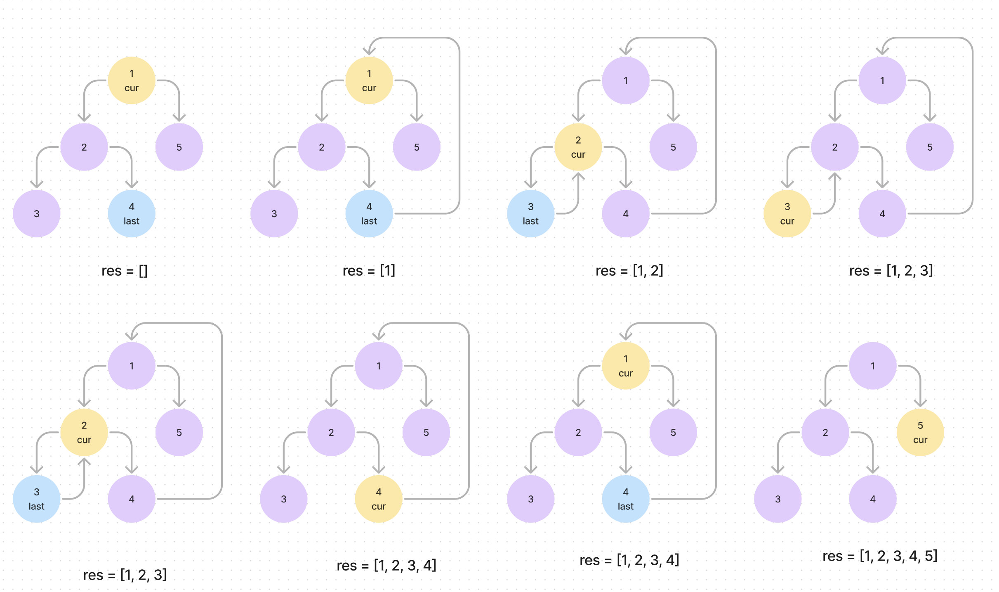

## 개념

### Tree

그래프의 일종으로, 여러 노드가 한 노드를 가리킬 수 없는 구조이다. => connected graph without a cycle   
- No cycle => unique path between two nodes
- Fully connected


### Binary Tree

child node가 최대 두 개인 트리이다. child가 없는 노드는 leaf라고 한다.   

- balanced binary tree   
  - 어떤 노드에서 보더라도 왼쪽 subtree와 오른쪽 subtree의 높이가 최대 1 차이나는 경우이다.
- complete binary tree   
  - 트리의 각 레벨이 다 채워져야하는데 마지막 레벨에서의 rightmost 노드는 비어있을 수 있다.   
  - 위에서 아래로, 왼쪽에서 오른쪽으로 차례대로 채워지는 트리이다.   
  - 이걸 array로 나타낸 경우 root가 index 1일 때, index n인 노드에 대해 parent node는 arr[n//2]이고 left child node는 arr[n * 2], right child node는 arr[n * 2 + 1]이다.   
  - leaf node인지 아닌지는 index <= len(arr) // 2 이면 leaf node가 아닌 것이다.   
- full binary tree   
  - 자식 노드가 0이거나 두 개인 트리이다. 한 개의 자식노드를 갖지 않는다.   
- perfect binary tree   
  - complete이면서 full인 binary tree이다. 모든 leaf 노드들이 같은 level에 있으며 꽉 차있다.   


### Binary Search Tree(BST)

- 왼쪽 자식 노드들은 자기보다 다 작거나 같고, 오른쪽 자식 노드들은 다 자기보다 높다.   
- in-order traverse를 하면 정렬된 순서로 방문한다.   
- balanced 상태면 검색에 O(log N)이 걸리고 unbalanced면 최대 O(N)걸린다.    
- balanced라도 root가 중앙값이란 보장은 없다. root기준 left subtree 노드 개수와 right subtree 노드 개수가 동일해야 median이다.
- insert
  - leaf에 넣는다. root부터 시작해서 자기 위치를 찾아 내려온 뒤 leaf 노드에서 알맞은 child leaf로 생성한다.
- delete
  - leaf라면 그냥 삭제한다. 
  - 하나의 child가 있는 경우 노드 삭제하고 child를 parent로 연결한다. 
  - child가 둘 이상인 경우 successor 노드를 찾아야한다. right subtree에서 가장 작은 노드를 찾아서 값을 바꾼 뒤 그 successor 노드를 삭제한다.


## Traversal

- in-order traversal   
  - inOrder(node.left) => visit(node) => inOrder(node.right)   
  - 작은 값부터 차례로 방문하게 된다.   
- pre-order traversal   
  - visit(node) => preOrder(node.left) => preOrder(node.right)   
  - root부터 시작하는 traversal이다.   
- post-order traversal   
  - postOrder(node.left) => postOrder(node.right) => visit(node)   
  - root가 제일 마지막에 visit된다.   
- level-order traversal   
  - queue를 두고 traverse한다.       
  - recursion을 이용할 수도 있다. preorder traverse하면서 level을 저장하면서 맞는 level에 append한다.    
  - result list의 길이가 현재의 level보다 크지 않다면 빈 list를 append함으로써 현재 level에 맞는 공간을 만들어준다.


iterative한 in-order 탐색
```python
# 왼쪽으로 내려오면서 stack에 넣는다. 그러면 그 stack에는 제일 작은 게 top에 있게 된다.
# stack에 있는 거 하나 pop해서 처리하고 그 right child로 이동한다. 그 다음 작은 건 그 값의 right child이기 때문이다.
# right child에 대해 동일하게 해준다. right child가 없으면 다시 stack에서 pop한다.
res = []
while stack or root:
  while root:
    stack.append(root)
    root = root.left
  root = stack.pop()
  # operation
  res.append(root)
  root = root.right  # 여기서 root.val 을 수정하는 게 아니라 root 라는 변수의 포인터 자체를 바꾸니까 res 안에 있는 것에 영향이 없다.
```

iterative한 pre-order 탐색

```python
res = []
while stack:
    curr_node = stack.pop()
    if curr_node:
        # operation
        res.append(cur_node)
        stack.append(curr_node.right) # 먼저 넣는 게 나중에 처리된다.
        stack.append(curr_node.left)
```

이 traversal은 O(n) time / O(h) space 가 필요하다.   
space는 O(h)가 되는데, recursion을 쓰든 iteration을 쓰든 끝날 때 stack에서 removed되고 다음 작업에서 그 공간을 재사용하기 때문이다.


### BST에서 자주 쓰이는 코드 snippet

inorder 결과 출력    
inorder 결과는 순서대로 정렬되어야한다. 아래처럼 정의하면 모든 노드에 대해서 왼쪽 subtree의 값이 먼저 나오고 자기 노드가 나오고 오른쪽 subtree의 값이 나오는 게 보장된다.

```python
def inorder(root: Optional[TreeNode]) -> List:
    return inorder(root.left) + [root.val] + inorder(root.right) if root else []
```

successor(다음 값) 찾기: right가 없으면? None이 나오는 거지.   
right subtree 에서 가장 작은 값을 찾는 것이다.

```python
def successor(root: TreeNode) -> TreeNode:
    root = root.right
    while root.left:
        root = root.left
    return root
```

predecessor(이전 값) 찾기

```python
def predecessor(root: TreeNode) -> TreeNode:
    root = root.left
    while root.right:
        root = root.right
    return root
```


### Moris Traversal

O(1) space로 탐색하는 방법이다.

#### preorder

개념
- O(n) space가 필요했던 이유는 각 노드에서 left child를 모두 탐색했는지를 확인해야 parent로 return한 후에 right child로 갈 수 있기 때문이다.
- 하지만 left subtree의 마지막 노드와 root를 연결시킨다면 이 오버헤드를 O(1) space로 줄일 수 있다.

동작
- res list를 만들고 cur, last 두 개의 pointer를 만든다. cur은 처음에 root부터 시작을 한다.
- cur에게 left child가 있는지 확인한다.
- left child가 있다면 left subtree의 rightmost node를 찾아서 그 node의 right child를 cur로 연결한다.
  - 나중에 cur를 다시 방문하는 경우가 생기는데 그때를 인지할 수 있어야한다.    
  - 다시 cur를 방문한 경우 left subtree의 rightmost child를 찾으려고 할 때 cur를 또 다시 방문할 것이다.    
  - 그런 경우 right subtree로 넘어가도록 한다.     
- left child가 없다면 cur를 res에 추가를 한다.

left subtree의 rightmost의 right child를 cur 대신 바로 cur.right로 연결하면 안되나 생각도 했었다.   
그런데 그렇게 하면 right subtree로 넘어가는 타이밍을 모르고 노드들이 서로 계속 연결만 돼서 무한 루프가 생길 수 있다.   


O(n) time / O(1) space가 필요하다.   
각 노드는 최대 두 번 방문이 될 수 있다.   



<details>

```python
def preorderTraversal(self, root: Optional[TreeNode]) -> List[int]:
    answer = []
    curr = root
    
    while curr:
        # cur에 대해서 left child가 없으면 cur에 대한 작업을 하고 right child로 간다.
        # leaf node라도 right most한 node에 대해 그 당시의 root로 연결해놨기 때문이다. 없으면 loop가 끝난다.
        if not curr.left:
            answer.append(curr.val)
            curr = curr.right

        else:
            last = curr.left
            # while last.right 조건은 단순히 rightmost를 찾는 조건이다.
            # while last.right != curr 조건이 중요한데,
            # cur와 left subtree의 rightmost node가 같아지는 순간이 올 수 있다. 이 때는 cur이 rightmost를 통해 다시 방문된 경우이다.
            # 이 cur는 이미 방문된 node이며 방문될 때 rightmost의 right로 연결이 되었다. 그 rightmost가 방문되고 다시 이 cur로 돌아온 것이다.
            # 따라서 지금의 cur.left의 rightmost를 따라가다보면 다시 cur가 방문된다.
            # 이 경우 cur는 이미 처리됐으므로 cur.right로 가야한다.
            while last.right and last.right != curr:
                last = last.right
                
            if not last.right:
                # rightmost node를 찾은 상황이다. cur와 연결해주고 cur를 처리한 뒤에 left로 넘어간다.
                answer.append(curr.val)  # cur를 처음 방문했을 때 left subtree's rightmost node's child로 연결하고 ans에 넣는다.
                last.right = curr
                curr = curr.left
            else:
                # last.right == curr 인 상황으로 curr에 두 번째 방문한 상황이다. curr의 right subtree로 넘어가야한다.
                last.right = None  # 원래 상태로 복구
                curr = curr.right
    
    return answer
```

</details>


#### inorder

- 원리
  - parent 노드룰 찾는 방법은 동일하다. 
  - 내려가기 전에 res list에 값을 넣었던 preorder과 달리 위로 올라오면서 res list에 값을 넣어주는 것이다.
- 동작
  - root부터 cur로 놓는다.
  - cur의 left가 없으면, cur에 대해 처리하고 cur = cur.right 로 옮겨준다.
  - cur의 left가 있으면, cur를 left subtree의 rightmost node 를 찾는다.
    - 이 때, rightmost node 를 찾으려고 내려가다가 출발점인 cur와 동일해지는 순간이 있다면 한바퀴를 돌아서 cur로 돌아왔다는 뜻이다. 임시로 만들었던 cur과의 관계를 끊고 cur를 처리하고 right child 로 이동한다.
    - rightmost 를 성공적으로 찾으면 그 노드의 right child 를 cur로 설정해준다. 그 뒤에 cur = cur.left로 이동한다.
- 시간 복잡도
  - 각 노드마다 최대 세 번 접근한다.
    - current node 방문 
    - left child 방문
    - left child 기준 right subtree 의 right child 들 끝까지 방문
    - current node 재방문
    - current 를 left child 로 이동
  - left child 기준에서는 처음에 parent가 자기 체크할 때 한 번, 자기가 current 가 될 때 한 번, 그리고 자기 기준 left subtree의 rightmost 노드 처리가 끝나고 다시 자기한테 돌아올 때 한 번이다.

<details>

```python
def inorderTraversal(self, root: Optional[TreeNode]) -> List[int]:
    res = []

    cur = root
    while cur:
        if cur.left:
            last = cur.left
            while last.right is not None and last.right != cur:
                last = last.right
            if last.right == cur:
                # rightmost의 right child로 연결되어 다시 방문한 상황이다.
                last.right = None  # 임시로 연결해놓은 것을 끊는다.
                res.append(cur.val)  # 다시 방문했을 때 cur를 넣는다.
                cur = cur.right
                continue
            last.right = cur
            cur = cur.left
        else:
            res.append(cur.val)
            cur = cur.right
    
    return res
```


</details>


## Top-down vs Bottom-up

### Top-down

위에서 아래로 데이터를 전달한다.

적용 조건
- 현재 노드의 정보를 자식에게 넘겨줄 parameter 로 정의할 수 있는가?
- 부모가 준 값과 현재 노드의 값을 조합해 자식에게 줄 새로운 값을 계산할 수 있는가?

특징
- preorder traversal과 유사하다. 자기 자신을 먼저 처리하고 child 로 이동한다. 
- recursive function `top_down(node, params)` 을 사용한다. 
- parameter 를 통해 부모가 자식에게 상태를 전달한다. 
- 예시로 binary tree의 maximum depth를 구하는 것이 있다.

동작
1. null node에 대한 base case를 정의한다. (`if node is None: return`)
2. ans를 업데이트해야하면 업데이트한다. (leaf node라면 `ans = max(ans, cur_depth)` 로 업데이트한다.)
3. `left_ans = top_down(node.left, cur_depth+1)` 로 left subtree에 대한 답을 구한다.
4. `right_ans = top_down(node.right, cur_depth+1)` 로 right subtree에 대한 답을 구한다.
5. 필요 시 return ans (recursion이 끝나고 함수 바깥에서 `return ans`)

child로 내려갈 때 ans 변수를 넘겨주고, 해당 child에서는 업데이트된 ans를 반환할 것 같다.

### Bottom-up

적용 조건
- 자식 노드들이 계산해서 보내준 결과값이 있는가?
- 자식들의 결과값들을 활용해 현재 노드의 정답을 도출할 수 있는가?

특징
- child node로 recursive하게 호출한 후 child node에서 return한 값과 current node의 값을 통해서 결과를 계산한다.   
- postorder traversal과 유사하다. child를 먼저 호출하고 그 값들을 통해 올려보낼 값을 정한다.
- return 값을 통해 자식이 부모에게 상태를 전달한다.
- 이것도 마찬가지로 binary tree의 maximum depth를 구할 수 있다.   

동작
1. base case를 정의한다. (`if node is None: return 0`)
2. left_ans = bottom_up(node.left)
3. right_ans = bottom_up(node.right)
4. return answer (`return max(left_depth, right_depth) + 1`)

top-down과 다르게 ans 변수를 넘겨주지 않아도 된다. leaf에서 만든 데이터를 올려보내면서 답을 업데이트한다.

