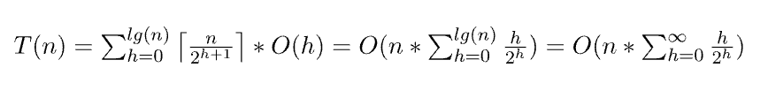

## 개념

- 정렬된 순서가 아닌, 최댓값 혹은 최솟값만 필요한 경우 사용한다.   
- priority queue라는 개념이 있는데 이는 abstract data type이고 실제 자료 구조는 아니다.   
- priority queue를 구현하는 방법에 linked list, heap 등이 있는 것이다.   
- linked list의 경우 insertion, deletion에 대해 O(1)의 시간이 걸리지만 검색에는 O(N)의 시간이 걸린다.   
- heap의 경우는 insertion, deletion에 대해 O(logN)의 시간이 걸리지만 min/max 값을 찾는 데는 O(1)의 시간이 걸린다.


### Implementation

heap은 complete binary tree이고 각 노드의 값은 자식 노드보다 큰 값을 갖지 않는다. 
left, right 포인터 없이 index로만 부모 자식을 찾기 위해 complete binary tree 를 사용한다.   

complete binary tree의 특징
- 마지막 레벨을 제외한 모든 레벨이 노드로 꽉 차 있어야 한다.
- 마지막 레벨은 왼쪽부터 빈틈없이 차례대로 채워져야 한다.
- root index가 1이고 현재 노드가 arr[n]일 때 
  - parent node: arr[n//2]
  - left child node: arr[n*2]
  - right child node: arr[n*2+1]
- root index가 0일 때,
  - 부모 인덱스: (자식 인덱스 - 1) // 2 
  - 왼쪽 자식 인덱스: (부모 인덱스 * 2) + 1 
  - 오른쪽 자식 인덱스: (부모 인덱스 * 2) + 2
- arr[1] ~ arr[len(arr)//2] 까지는 leaf node가 아니다.

insertion
- complete binary tree가 되도록 leaf 노드에 추가를 한다.
- 그 노드에 대해 parent 노드와 비교하면서 자기보다 크면 자리를 바꾸면서 bubble up 한다.

deletion
- root를 제거하고 leaf 노드의 가장 오른쪽 노드를 root로 올려서 complete binary tree를 유지한다.
- root 위치로 올린 노드를 왼쪽과 오른쪽 child 노드들과 비교해서 크면 자리를 바꾸면서 bubble down 한다. 
left child, right child 둘 다 current보다 작다면 둘 중 작은 걸 고른다.

> complete binary tree니까 heap 구현을 list로 해도 괜찮을 것 같다. 
일반 tree의 경우는 비어있는 곳이 많을 때 list로 구현하면 너무 메모리 낭비가 심하다.


### Heap Sort

1. heapify: array를 complete binary tree로 바꾼 뒤 leaf node가 아닌 node들에 대해 작업한다.
2. root를 heap에서 뽑아서 array에 넣는다.
3. heap이 빌 때까지 반복한다.

O(NlogN) / O(N)

### python

```python
import heapq

myheap = [3, 1, 2]
heapq.heapify(myheap)  # 기본적으로는 minheap이기 때문에 maxheap을 구현하려면 -1을 곱해서 저장해야한다.
heapq.heappush(myheap, 5)  # myheap 이 heapify 되지 않아도 동작은 하지만 myheap 배열이 heap 의 성격을 갖지는 못 한다.
heapq.heappop(myheap)
heapq.nlargest(2, myheap)  # k개의 큰 원소를 리스트로 반환한다. 내부적으로 k 크기의 heap을 유지해서 동작한다. 따라서 O(N logk) 의 시간을 갖는다.

# count라는 dictionary에서 value가 큰 기준으로 nlargest 사용하기
count = {"a": 4, "b": 1, ...}
heapq.nlargest(k, count.keys(), key=count.get)
```

heapify의 complexity   
- O(N) time, O(N) space   
- O(NlogN)으로 생각할 수 있는데 O(N)이다. 각 노드의 heapify는 O(h)의 시간이 들고 h의 높이를 갖는 노드는 n/pow(2, h+1) 만큼 있다. 극한으로 보내면 upper bound는 O(N)이다.   
- https://www.geeksforgeeks.org/time-complexity-of-building-a-heap/   



big O notation이니까 n을 infinity로 보낸 것 이하의 시간이 걸려야한다.

## 전략

#### top k problems / k-th largest element   
- size k의 min heap을 만들고 k+1개째 부터는 넣어야할 값을 root와 비교해서 크면 root를 빼고 넣는다.   
- 전체 값들에 대해 완료했을 때 root가 k-th largest element이고 heap의 리스트가 top k elements이다.   
- O(Nlogk) / O(k) => 처음 k minheap 만드는 시간 k, 그 이후 작업 (N-k) * logk


