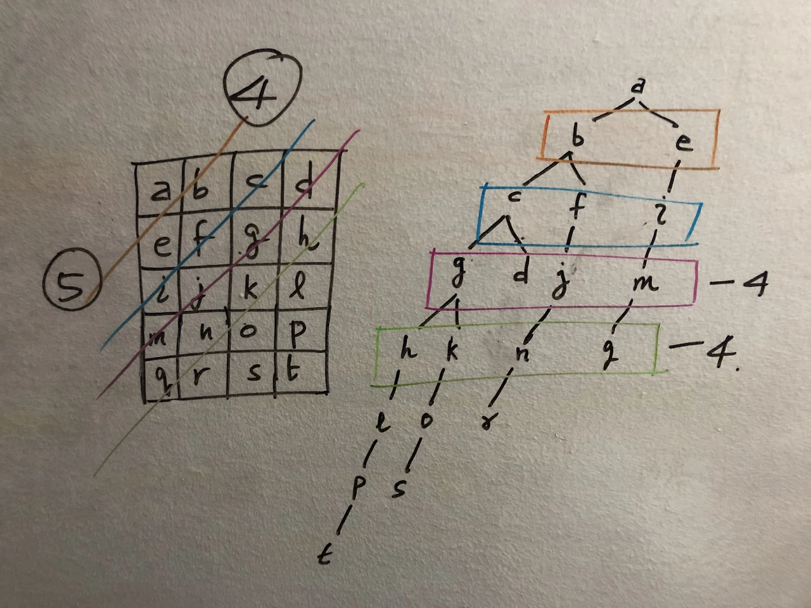

# 개념

vertex 집합 V와 edge 집합 E로 구성된 자료구조이다.    

그래프는 collection of vertices and edges이다. 각 edge는 direction을 가질 수도 있고 안 가질 수도 있다. weight도 가질 수도 있고 안 가질 수도 있다.   

트리는 그래프의 한 종류인데 connected, acyclic, and undirected graph 이다.   
Tree의 경우는 root가 존재하고 root만 알면 다 조회가 가능하다.   

### 용어

- cut
  - 그래프에서 두 개의 disjoint subset으로 나눌 때의 각 파티션이다.
- crossing edge
  - 하나의 vertex set에서 다른 vertex set으로 연결하는 edge들이다.
- adjacency list
  - 각 vertex는 인접한 노드의 리스트를 갖고 있다. undirected라면 연결된 두 노드는 서로의 노드를 저장한다.
- adjacency matrix
  - N개의 노드에 대해서 NxN matrix를 갖고 (i, j) 위치의 값은 i에서 j로의 edge가 있는지를 나타내는 boolean 값이다. undirected graph라면 symmetric matrix가 만들어진다.
  - edge 수가 node 수에 비해 상당히 클 때 효과적이다. edge 수가 적으면 matrix가 차지하는 공간에 비해 실제 사용되는 데이터가 적기 때문에 비효율적이다.
  - adjacent node를 iterate한다고 했을 때 adjacency list를 사용하면 바로 접근이 가능하지만 adjacency matrix를 사용하면 한 row를 다 읽어야한다.
- sparse graph
  - vertex 수보다 edge 수가 적은 그래프이다.
- clique
- connected

### 특징

DAG 그래프 안에서 최대 pow(2, N-1) -1 개의 distinct, non-empty path가 있을 수 있다.    
두 vertices 사이에는 최대 한 개의 path가 있을 수 있다. 따라서 N개의 element로 만들 수 있는 subset의 수를 구해야한다.    
어떤 subset에서 각 element마다 exist or abscent 둘 중 하나가 된다. 따라서 2^N 개의 subset이 존재할 수 있고, 모두 abscent인 경우는 empty subset이므로 path는 at most pow(2, N) - 1 이 된다.    

기본적으로는 connected graph가 아니라면 모든 노드의 리스트를 저장하고 있어야한다.    

### DFS

두 노드 사이의 path와 관련된 문제일 때 고려할 수 있는 방법이다.   
모든 path를 찾을 때 쓸 수 있다.   
stack 혹은 recursion을 사용한다.   
Time: O(V+E), Space: O(V)   

All possible paths를 구할 때 recursion을 사용하여 backtracking을 한다.   
이 때 각 작업마다 path를 고유하게 갖고 있어야하는데 처음에는 다음 recursion을 호출할 때 현재 path를 deepcopy하여 넘겨줬다.   
그런데 그렇게 하면 너무 시간이 많이 걸리기 때문에 dfs함수 부를 때 cur_path list를 넘겨줘서 그대로 사용한다. dfs 함수가 끝나면 cur_path.pop()를 해주는 방식으로 원래의 상태로 돌아옴으로써 시간을 절약할 수 있다.   
Time: O(2^N * N) => 가능한 path가 2^(N-1)-1, 각 path마다 다음 path 만들 때 O(N)개의 다음 node가 있으니까 O(N)의 시간 필요. 두 개 곱하면 loose upper bound   
Space: O(2^N * N) => 가능한 path가 2^(N-1)-1, 각 path마다 O(N) 노드가 있다.   

혹은 다른 개념이긴 하지만, dp(n): n에서 target까지의 모든 path list라고 할 때 dp(n) = [n] + next_path for next_path in dp(adj[n]) 로 dp로 풀수도 있다.   

### BFS

두 노드 사이의 shortest path 찾을 때 유용하다. 단 각 node, edge가 동일한 weight일 때 사용 가능하다.   
shortest path를 찾으려면 path를 리스트 복사해가면서 저장해야겠지만 shortest path length를 찾을 땐 count만 가져가면 된다.   

2d array에서 BFS의 space complexity: min(M, N)    
직사각형의 2d array를 대각선 단위로 탐색한다고 생각하면 된다. BFS를 진행하면서 큐의 최대 크기가 min(M, N)이 된다.
(https://imgur.com/gallery/M58OKvB)

### Bidirectional search

src에서 dest까지의 최단 경로를 찾는 방법이다..   
각 노드가 최대 k개의 adjacent node를 갖고, s에서 t까지의 최단 거리가 d라고 해보자.   
BFS를 사용하는 경우 하나의 level 지날 때마다 하나의 노드 당 k개의 edge가 있으므로 `k*k*...*k`를 d 번 해야 도착한다. 즉, exponential하게 증가하게 되고 O(k^d)의 시간이 걸린다.   

bidirectional search를 사용하면 s와 t 두 노드에서 동시에 시작하기 때문에 O(2 * k^d/2) 의 시간이 걸린다.   
s와 t에서 탐색을 하다가 두 그래프가 만나면 종료하게 된다.   
출발지와 목적지가 명확하게 주어지고, branching factor가 양방향에서 봤을 때 같을 때 사용하면 유용하다.   

양쪽에서 BFS를 하게 되는데 각 방향에 대해 queue와 parent라는 게 필요하다.   
parent는 그 탐색에서 어떤 노드에 대해 이전 노드를 저장하는 데이터이다.   
그래야 나중에 intersection을 기준으로 src까지의 path, dest까지의 path를 역으로 추적할 수가 있다.   

## Minimum spanning tree

spanning tree란 undirected graph에서 최소의 edge로 모든 vertex를 잇는 subgraph이다. 하나의 undirected graph는 여러 개의 spanning tree를 가질 수 있다.   

minimum spanning tree란 weighted undirected graph에서 최소의 edge weight을 갖는 spanning tree이다.   
cut property: 두 cut을 잇는 crossing edge 중 가장 weight가 작은 edge가 MST(minimum spanning tree)를 구성하게 된다.

- Kruskal's algorithm: edge를 추가하면서 MST를 만든다.
- Prim's algorithm: vertex를 추가하면서 MST를 만든다.

### Kruskal's Algorithm

1. edge를 weight가 증가하는 순서로 정렬 또는 heapify한다.
2. weight가 작은 edge부터 MST에 추가한다. 이 때 union-find를 사용하여 cycle을 만드는지 체크하고 cycle 만드는 edge는 넘어간다.
3. N-1 edge를 찾을 때까지 2번 동작을 반복한다.

greedy algorithm과 union-find algorithm을 사용한다.   
sorting을 해도 되고 heap을 써도 된다.   
왜 N-1개의 edge가 필요한가는 귀납법으로 증명하자. 2개일 때 한 개가 필요하다. vertex가 하나 추가되면 하나의 edge만 더 추가돼야한다.

- Time Complexity: O(E log E)   
  - sorting하는 데 O(E log E) 시간이 걸리고 각 edge마다 양 끝 vertex가 같은 component에 연결되어있는지 확인하는 데 O(a(V)) 가 걸린다. a()는 Ackermann 함수이다. - 따라서 O(E log E + E a(V)) = O(E log E) 이다.   
- Space Complexity: O(V)   
  - union-find data structure를 사용하는 데 O(V)의 공간이 필요하다.   

### Prim's Algorithm

1. visited set을 두고 처음에 임의로 vertex 0을 넣는다.
2. vertex 0에서 나머지로 가는 edge들을 heap에 넣는다.
3. heap에 있는 edge 중 최소 weight edge를 뽑는다. 상대 vertex가 unvisited라면(맨 처음은 무조건 unvisited일 것이다.) 그 vertex를 visited에 넣는다.
4. 해당 vertex에서 갈 수 있는 edge들을 heap에 넣는다. 그럼 vertex 0에서 나가는 edge와 새로 추가된 vertex에서 나가는 edge가 모두 heap에 있다.
5. 그 중 최소를 뽑아서 unvisited인 vetex인지 확인하고 visited면 넘어간다. unvisited면 visited set의 크기가 N이 될 때까지 이를 반복한다. 

greedy strategy를 사용한다.   
visited set, unvisited set은 visited라는 boolean list를 사용해서 할 수도 있다.   

Kruskal's algorithm은 edge를 추가하면서 mst를 확장하지만 Prim's algorithm은 vertex를 추가하면서 mst를 확장한다.

- Time Complexity: O(E log V) for binary heap, O(E + V log V) for Fibonacci heap.   
- Space Complexity: O(V)   

## Single Source Shortest Path Algorithm

BFS와 같은 방법은 모든 edge의 weight 가 같을 때 사용된다.   
하지만 weight가 edge마다 다르다면 사용할 수 없다.   
edge relaxation란, 다른 vertex를 거치더라도 더 weight 합이 작은 길을 찾는 것이다.   

하나의 source vertex를 두고 각 vertex까지 닿는 최소 path와 길이를 구하는 게 single source shortest path algorithm이다.

### Dijkstra's Algorithm

non-negative weight의 weighted directed graph 에서 사용할 수 있다.   
Greedy approach를 사용한다. 각 단계에서 갈 수 있는 vertex를 보면서 그 vertex로 가기 위한 최소의 weight를 구한다.

어떤 최단 경로는 최단 경로들의 합이다. 즉, d까지의 최단 경로는 d로 갈 수 있는 모든 vertex들까지의 각 최단 경로에서 d로 이동할 수 있는 걸 합한 게 최소인 경로이다.   

- 두 가지 버퍼가 필요하다. 
  - `dest_to_min`: key는 dst vertex, value는 src에서 dst까지의 최소 distance 값이다. 처음에는 src는 0, 나머지는 inf로 초기화를 한다. path를 구하려면 value에 (distance, previous) 를 넣는다.
  - `edge_heap`: `(weight, s, d)` 가 들어가게 된다. s에서 d를 잇는 edge가 있고 그 비용은 weight이다. 처음 시작할 땐 `(0, src, src)` 를 넣는다.
- heap에서 최소 weight를 갖는 edge를 뽑고 그 edge의 dst에 인접한 edge들을 iterate한다. 
- 각각의 그 edge로 이동했을 때 next vertex의 dest_to_min 값이 줄어들지 않는다면 무시한다. 이 edge를 타는 건 필요가 없다.
- next vertex의 dest_to_min 값이 줄어든다면 이후 값들을 또 다시 계산해야한다. dest_to_min을 업데이트하고 `(new edge weight, dst, next vertex)` 를 heap에 넣는다.
- heap의 크기가 0이 될 때까지 반복을 한다. heap의 크기가 0이라는 건 dest_to_min에 더 이상 영향을 줄 edge가 없다는 뜻이다.

내 의문점: 어떤 vertex v1에서 거기에 인접한 v2를 업데이트했다. 그런데 나중에 그 v1이 더 최소 path가 있다는 걸 알게 될 수 있지 않을까? 그러면 v2는 이미 이전의 값으로 계산이 됐는데?    
답: v1이 다시 업데이트 되면 v1의 인접 edge가 다시 heap에 들어가게 되고 다시 v2를 업데이트하게 된다. 즉, edge마다 한 번씩만 처리되지는 않는 것이다.

Proof skip...   

만약 negative weight edge가 있다면 이 방법을 사용할 수 없다. 한 vertex에서 가장 weight가 작은 edge를 골라서 이동하더라도 그 distance가 최소임을 보장할 수 없기 때문이다.   
멀리 돌아오는데 큰 negative weight가 있다면 돌아오는 게 weight가 더 작다.   
이동할 때마다 그때의 distance가 최소임을 보장하고 해당 vertex는 visited set에 넣고 끝내버려야하는데 그렇게 못 한다.

대표 예제: `743. Network Delay Time` https://leetcode.com/problems/network-delay-time ([내 정리](https://github.com/yoonsch217/codingtest/blob/main/graph/problems.md#743-network-delay-time))

- Time Complexity: O(E+VlogV) when a Fibonacci heap is used, O(V+ElogV) when a Binary heap is used.   
  - heap에 최대 V개의 값이 들어갈 수 있으므로 heappop에 logV가 걸리고, edge만큼 수행하니까 ElogV이다? 
- Space Complexity: O(V)

### Bellman-Ford Algorithm

모든 weighted directed graph에서 사용할 수 있다.   
하지만 negative weight cycle이 있으면 답이 없다.

Basic Theorem
- negative-weight cycle이 없는 그래프에서 어떤 두 노드의 shortest path는 최대 N-1개의 edge를 갖는다.    
- negative-weight cycle이라는 건 어떤 cycle이 있을 때 그 cycle을 한 번 돌 때의 weight 합이 음수인 경우이다.
- 어떤 path가 N 이상의 edge를 갖는다는 건 cycle이 있다는 건데 positive cycle일테니 weight가 늘어날 것이다. 따라서 최대 N-1개의 edge를 갖는다.
- negative-weight cycle이 있는 그래프에서는 shortest path가 없다.

이런 문제는 Dynamic Programming 를 이용해서 풀 수 있다.
- dp(k, u): 최대 k개의 edge를 이용해서 u로 갈 때의 최소 weight sum. k의 범위는 1부터 N-1 까지가 된다. 각 값의 초깃값은 inf이다. dp(0, source) = 0
- directed graph에 대한 adjacent matrix를 만든다.
- k가 0일 때는 source vertex 빼고 다 inf의 값을 그대로 갖는다. 그 이후 k를 1부터 N-1까지 차례로 늘리며 작업을 한다.
- u를 향하는 edge가 있는 vertex들을 찾은 후 각 v에 대해 `k-1 개의 edge를 사용해서 v로 가는 최소 weight sum + v에서 u로 가는 weight` 들의 최솟값을 구하여 저장한다.
  - `dp[k][u] = min(dp[k-1][v] + w(v, u) for v in [vertices that go directly to vertex u])`
- k가 N-1일 때의 값들이 최종 결과이다.

Complexity
- Time Complexity: worst, avg O(VE) 모든 vertex가 서로 연결되어 있는 경우. best O(E)
  - dp의 모든 값을 만들긴 해야하지 않나? 그러면 총 dp matrix는 V x V가 될 거다. k는 1부터 N이고 u는 각 vertex니까 1부터 N이다. 각 iteration은 E. VxVxE?
- Space Complexity: O(V^2) V*V matrix를 저장해야한다.

Bellman-Ford 알고리즘은 기본적으로 dp인데 최적화를 시킨 알고리즘이다.   
dp matrix를 보면 모든 k에 대해 저장할 필요가 없다. 현재 k에 대한 row와 이전 k-1에 대한 row만 있으면 된다.   
이 iteration을 k번 한다면 source에서 k번 움직여서 갔을 때의 결과값이다.   

조금의 최적화를 더 하자면, k를 1부터 N-1까지 순차적으로 늘려가면서 하지 않아도 된다.   
res list를 inf로 초기화한 후, 한 번 작업할 때 모든 edge에 대해서 iterate하면서 `res[u] = min(res[u], res[v] + w(v, u))` 를 한다.
이 작업은 최대 N-1 반복하는데 그 전에 값이 안 변할 수 있다. 그러면 그 이후에도 값이 안 변할테니 멈추면 된다.

한계: edge의 iterate하는 순서가 영향을 미친다. edge 리스트가 잘못된 순서로 있으면 edges iteration마다 업데이트 되는 횟수가 적다. edge 리스트가 잘 돼있으면 edges iteration마다 업데이트가 자주 될 수 있다.

### SPFA Algorithm(The Shortest Path Faster Algorithm)

Bellman-Ford 알고리즘의 비효율적인 부분이 있는데 이 부분을 큐를 사용하여 최적화시킨 알고리즘이다.    

- 결과 리스트 `res` 를 생성한다. size N의 리스트이고 `res[src] = 0`, 나머지는 `math.inf`
- `q` 큐를 생성한다. 처음에 src를 넣은 상태로 시작한다.
- `is_queued` 리스트를 생성한다. node가 queue에 있다면 `is_queued[node] = True`
- 큐에서 하나를 뽑는다. 뽑을 땐 `is_queued` 도 업데이트해줘야한다. 
- 뽑힌 노드에서 나가는 모든 edge를 iterate하면서 도착지 노드의 res 값이 업데이트 되는지 확인한다.
- 업데이트 된다면 그 노드는 다시 큐에 넣어야한다. 그 노드의 값이 업데이트되면 그 노드에서 나가는 edge들을 통해 업데이트할 게 남아있을 수 있기 때문이다. `is_queued` 에 있다면 넣지 안흔ㄴ다. 불필요한 중복을 막아준다.
- 큐가 비게 되면 더 이상 업데이트할 게 없다는 뜻이므로 res를 반환한다.

Complexity
- Time Complexity: 모든 노드에 대해 한 번씩은 작업하는데 모든 에지를 작업하므로 O(VE)가 된다.
- Space Complexity: O(V)

## Kahn's Algorithm for Topological Sorting

Directed Acyclic Graph에서 vertex 사이에 순서가 있을 때 linear sorting을 제공한다.
Prerequisite가 있는 course를 듣는 순서를 정하는 상황이 하나의 예이다. cycle이 있으면 불가능하다.

in-degree 라는 값이 있다. 해당 vertex에 대해 required vertex가 몇 개가 남았는지를 나타낸다. required vertex 중 하나가 처리되면 in-degree 값은 1 감소한다. 맨 처음 시작할 때는 in-degree 값이 0인 vertex를 찾아서 시작한다.    
기본적으론 V 개의 vertex에 대해서 모든 E 만큼 반복해야하기 때문에 O(VE) 시간이 걸리고 O(V) 공간이 필요하다.   

하지만 adjacency list를 만들어서 `adj_list[course]` 가 course에 dependent한 course를 저장한다면 O(V+E) time과 O(V+E) space가 필요하다. 처음 adj list 만들 때 O(E) 시간이 필요하고 그 이후에는 vertex 방문할 때마다 연결된 edge만 찾아서 in-degree를 줄여주면 된다. 연결된 edge만 방문하기 때문에 전체 작업을 수행하면 edge는 한 번씩만 방문된다. space의 경우는 adj list 만드는 데 O(E) 공간이 필요하고 in-degree 값 저장하는 데 O(V) 공간이 필요하다.

DAG 에서만 가능하다. in-degree가 0인 vertex가 하나는 있어야 가능하다. 

https://leetcode.com/problems/course-schedule-ii/

## cycle 있는지 확인하는 방법

vertex를 white, gray, black으로 색칠하는 방법이 있다.   
처음에는 모든 vertex가 white이다.    
작업이 시작되었지만 모든 descendants가 처리되진 않았다면 gray이다. 이동하다가 gray vertex를 만나게 되면 cycle이 있다는 것이다.   
모든 descendant가 처리되면 black이 된다. black 처리가 되면 이후 traverse에서 black vertex로 가더라도 cycle이 만들어지지 않는다. 이미 다른 traverse가 시작된 것이기 때문이다.   

# 전략

Shortest Path를 찾을 때
- unweighted graph => BFS
- weighted graph with positive weights => Dijkstra
- weighted graph with negative weights => Bellman-Ford
